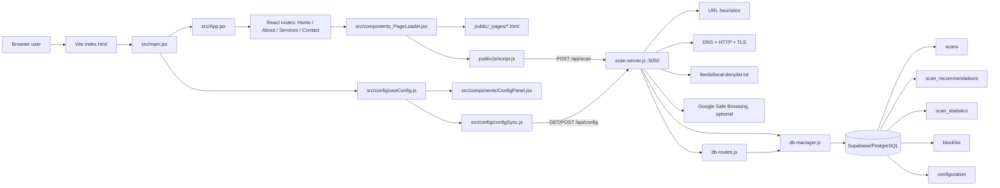
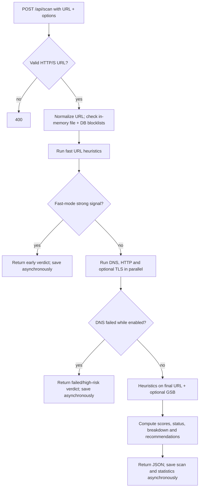

# URLY Warning — Graphified Repository Map

> Token-efficient map of the workspace, generated from the checked-in files on 2026-10-04. Read this file first; open only the paths listed for the task at hand. Runtime/status reports are historical evidence, not guaranteed current state.

## 1. Workspace at a glance

```text
URLYWARNING/
├─ GRAPHIFY.md                 # this map
├─ package-lock.json           # tiny root-level lockfile; main app is below
└─ Websz/                      # actual application root
   ├─ package.json             # npm scripts and dependencies
   ├─ index.html               # Vite entry document
   ├─ src/                     # React shell and current config UI
   ├─ public/                  # legacy HTML/CSS/JS plus images
   ├─ scan-server.js           # Express scanner/API server
   ├─ db-manager.js            # Supabase persistence layer
   ├─ db-routes.js             # HTTP-to-database route adapters
   ├─ supabase-config.js       # active database client bootstrap
   ├─ supabase-schema.sql      # active Supabase/PostgreSQL schema
   ├─ feeds/                   # local denylist; generated feed may appear here
   ├─ scripts/update-feeds.js  # downloads/normalizes public threat feeds
   ├─ test-*.js                # integration/config/database scripts
   ├─ database-exports/        # snapshots; large, usually skip
   ├─ *.md                     # many historical reports/guides; open selectively
   └─ node_modules/            # installed dependencies; never read for app context
```

Non-vendor inventory observed: 29 Markdown documents, 26 JavaScript files, 9 JSX files, 12 HTML files, 4 CSS files, 5 SQL files, 6 JSON files, 4 text files, and image/static assets. `public/` is asset-heavy; `scan-server.js` and `public/js/script.js` are the largest first-party code files.

## 2. System graph



### Scan request flow



## 3. Minimal reading sets

| Task | Read first | Read only if needed |
|---|---|---|
| Understand/start the app | `Websz/package.json`, `Websz/README.md` | `Websz/vite.config.js`, `.env.example` |
| Change routing/page shell | `Websz/src/App.jsx`, `Websz/src/components_PageLoader.jsx` | matching `Websz/src/pages/*.jsx` |
| Change page content | matching `Websz/public/_pages/*.html` | `public/css/style.css`, `public/js/script.js` |
| Change scanner UI behavior | `Websz/public/js/script.js` | `public/js/result-display.js`, `src/utils/scannerAPI.js` |
| Change settings UI | `src/components/ConfigPanel.jsx`, `src/config/useConfig.js` | `src/config/scannerConfig.js`, `src/config/configSync.js` |
| Change scan logic | relevant region of `Websz/scan-server.js` | `feeds/local-denylist.txt`, `scanner.config.json` (do not expose values) |
| Change API/database routes | `Websz/scan-server.js` route block, `Websz/db-routes.js` | `Websz/db-manager.js` |
| Change database schema | `Websz/supabase-schema.sql` | `db-manager.js`, `SUPABASE-MIGRATION.md` |
| Test configuration behavior | `Websz/test-config-system.js` | `TESTING-REPORT.md`, `VERIFICATION_CHECKLIST.md` |
| Test database behavior | `Websz/test-db-operations.js` | `test-db.js`, `view-*.js` |
| Update threat feeds | `Websz/scripts/update-feeds.js` | `feeds/local-denylist.txt` |

## 4. Source map

### Frontend shell (`Websz/src`)

- `main.jsx` — mounts React with `HashRouter`, exposes the React config manager on `window`, starts database config sync.
- `App.jsx` — declares `#/`, `#/about`, `#/services`, and `#/contact`; mounts the global settings button/panel.
- `pages/*.jsx` — four thin wrappers that select an HTML fragment.
- `components_PageLoader.jsx` — fetches `public/_pages/<page>.html`, injects its body, rewrites `.html` links to hash routes, then dynamically loads `public/js/script.js`.
- `components/ConfigButton.jsx` — opens settings.
- `components/ConfigPanel.jsx` + `.css` — React settings editor.
- `config/scannerConfig.js` — default browser configuration and validation limits.
- `config/useConfig.js` — localStorage-backed config manager plus React hook.
- `config/configSync.js` — maps selected frontend paths to database config keys and syncs through `/api/config`.
- `utils/scannerAPI.js` — modular scan/batch/cache client; the injected legacy page also contains its own scan behavior in `public/js/script.js`.

### Legacy/static frontend (`Websz/public`)

- `_pages/index.html` — home/scanner markup.
- `_pages/about.html`, `services.html`, `contact.html` — other page bodies.
- `js/script.js` — central DOM controller and scanner UI; very large, so search for a symbol before opening a range.
- `js/result-display.js` — result renderer.
- `js/scanner-config.js`, `js/config-manager.js`, `js/config-ui.js` — older/global configuration implementation used by static test pages and loaded by the home fragment.
- `css/style.css` — primary styling; `reset.css` and `color-harmony.css` are supporting styles.
- `images/` and `img/` — product artwork and placeholders; skip unless doing visual work.
- `*-test.html`, `design-showcase.html`, `api-test.html` — manual browser harnesses, not production entry points.

### Backend (`Websz` root)

- `scan-server.js` — server bootstrap, feed/config refresh, scan engine, recommendations, score breakdown, all public HTTP routes, port `5050` by default.
- `db-manager.js` — active Supabase data access for scans, recommendations, statistics, blocklist, and configuration.
- `db-routes.js` — request/response adapters intended to call the data-access layer.
- `supabase-config.js` — reads environment variables and creates the Supabase client.
- `scanner.config.json` — optional server configuration/credential source; treat as sensitive.
- `db-config.js`, `database-schema.sql`, `init-db.js` — older MySQL-oriented path; not connected to the current server and `mysql2` is not declared in `package.json`.

### Data and operations

- `supabase-schema.sql` — canonical schema for five tables: `scans`, `scan_recommendations`, `scan_statistics`, `blocklist`, `configuration`.
- `database-exports/` — JSON/SQL snapshots and timestamped notes; do not load into context unless restoring or comparing data.
- `export-database.cjs`, `import-database.cjs` — snapshot tooling.
- `populate-blocklist.js`, `add-detection-sensitivity.js`, `enable-ssl-check.js` — one-off Supabase maintenance scripts.
- `view-all-data.cjs`, `view-blocklist.js`, `view-recommendations.js` — inspection utilities.
- `scripts/update-feeds.js` — produces `feeds/urls.txt`; that generated file was not present at mapping time. The server tolerates its absence and still loads `local-denylist.txt` plus the DB blocklist.

## 5. HTTP surface

Base URL: `http://localhost:5050`

| Method | Path | Purpose |
|---|---|---|
| POST | `/api/scan` | Scan one HTTP/S URL with optional per-request settings |
| GET | `/health` | Server/feed/GSB/database-config summary |
| GET | `/api/scans/recent` | Recent scan history |
| GET | `/api/scans/search?q=` | Search scan history |
| GET | `/api/scans/:id` | One scan and related data |
| GET | `/api/stats/today` | Today's aggregate statistics |
| GET | `/api/stats/summary` | Summary statistics |
| GET | `/api/stats/range?start=&end=` | Date-range statistics |
| GET/POST | `/api/blocklist` | List/add entries |
| DELETE | `/api/blocklist/:value` | Remove an entry |
| GET | `/api/blocklist/check/:value` | Test an entry |
| GET/POST | `/api/config` | Read/update synchronized config |
| GET | `/api/config/:key` | Read one config key |
| POST | `/api/cleanup/old-scans` | Delete old history |
| POST | `/api/cleanup/enforce-limit` | Enforce history cap |

## 6. Configuration and data precedence

Server-side configuration resolves in this order:

```text
environment variable
  > Supabase configuration table
    > Websz/scanner.config.json
      > in-code default
```

Browser settings originate in `src/config/scannerConfig.js`, persist under localStorage key `urlScanner_config_v2`, and selected keys sync to the backend through `src/config/configSync.js`.

Database access requires the Supabase environment values documented in `.env.example`. Never paste `.env`, `scanner.config.json`, API keys, service-role keys, or full exported database contents into prompts/logs.

## 7. Commands

Run from `Websz/`:

```powershell
npm install
npm run dev        # Vite frontend
npm run scan       # scanner/API on port 5050
npm run dev:all    # Windows helper: frontend + backend
npm run build      # production frontend build
npm run preview    # preview built frontend
npm run feeds:update
```

There is no unified `npm test` script. Tests are standalone Node scripts (for example `node test-config-system.js` and `node test-db-operations.js`) and may require the API, network, and Supabase credentials.

## 8. Current maintenance notes

1. The route-to-database method mismatches, scan error scope issue, and browser-delivered Safe Browsing credential found during this audit were repaired on 2026-10-04.
2. The frontend still has two overlapping configuration/scanner implementations (`src/config/*` and `public/js/*`). Confirm which path owns a behavior before editing.
3. Supabase-backed history, statistics, blocklist, and config routes require working Supabase connectivity. Core URL scanning continues with local defaults when it is unavailable.
4. `scanner.config.json` may contain a server-side credential and is now ignored alongside `.env`; do not expose or commit either file. Rotate any key that was previously shipped to a browser.
5. Many Markdown reports describe a historical “working” or “production-ready” state. Prefer current code and verification over those claims.

## 9. Documentation routing

Use these rather than loading all Markdown files:

- General startup: `README.md`
- API contract: `API-DOCUMENTATION.md`
- Configuration: `CONFIGURATION-GUIDE.md` and `CONFIGURATION-SYSTEM.md`
- Supabase setup/schema: `SUPABASE-SETUP.md`, `SUPABASE-REFERENCE.md`, `SUPABASE-MIGRATION.md`
- Scanner rationale: `GSB-EXPLANATION.md`, `SSL-VALIDATION-EXPLANATION.md`, `RECOMMENDATION-LEVELS-EXPLAINED.md`
- Architecture/process material: `SYSTEM-FLOW-DIAGRAM.md`, `SYSTEM-ANALYSIS-BPMN-COMPLETE.md`
- Historical validation only: `API-STATUS.md`, `API-WORKING-CONFIRMATION.md`, `SYSTEM-STATUS*.md`, `PRODUCTION-READY-REPORT.md`, `TESTING-REPORT.md`, `UPDATE-SUMMARY.md`

## 10. Token-efficient workflow

1. Start with this file and choose one row from **Minimal reading sets**.
2. Search symbols before opening large files, for example:

   ```powershell
   rg -n "searchTerm" Websz/scan-server.js Websz/public/js/script.js
   ```

3. Read narrow line ranges around matches instead of whole files.
4. Exclude `node_modules/`, `database-exports/`, images, lockfiles, and historical reports unless the task explicitly needs them.
5. For backend work, inspect `scan-server.js` plus only the directly called DB/config module.
6. For page work, inspect the matching `_pages/*.html`, then only the relevant CSS/JS selector or function.
7. Re-run searches against current code; do not trust line numbers quoted by old reports.

### Suggested context packets

```text
UI page packet:
  src/App.jsx
  src/components_PageLoader.jsx
  public/_pages/<page>.html
  matching selectors/functions from public/css/style.css and public/js/script.js

Scanner packet:
  scan-server.js::<matched functions + /api/scan route>
  feeds/local-denylist.txt (only if blocklist-related)
  src/config/scannerConfig.js (only if option/weight-related)

Database packet:
  scan-server.js::<relevant route>
  db-routes.js::<matching adapter>
  db-manager.js::<matching data method>
  supabase-schema.sql::<matching table>
```
