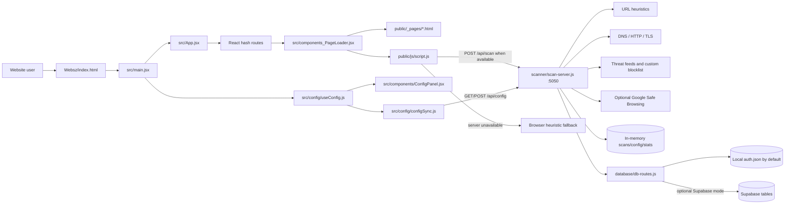
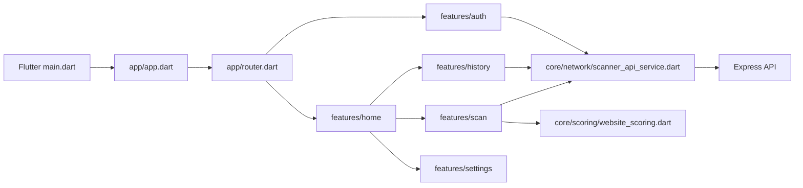
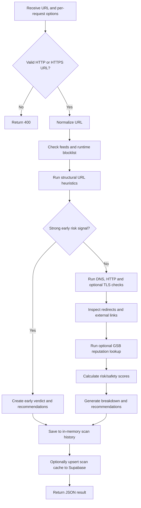
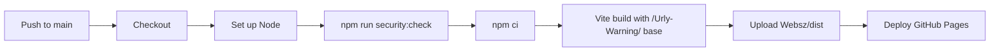

# URLY Warning — Repository Graph and Technical Guide

> Detailed, token-efficient map of the current BASTE PROMAX codebase. Updated and path-checked on 2026-10-09 after BASTE PROMAX became the main repository version.

## 1. What this repository contains

URLY Warning is a URL-safety system with three related deliverables:

1. **React/Vite website** — the primary browser interface and the version published through GitHub Pages.
2. **Node/Express scanner service** — adds DNS, HTTP, TLS, denylist, optional Google Safe Browsing, configuration, cache, history, and authentication endpoints when run locally or on a server.
3. **Flutter application** — a separate web/Android-oriented client that consumes the scanner/auth APIs and currently keeps its own login requirement.

The runnable application root is `Websz/`. Files at the repository root provide repository-level documentation, security policy, and GitHub automation.

### Current behavior at a glance

| Area | Current behavior |
|---|---|
| Public website | Opens directly at `#/home`; web login and registration routes redirect to the home page. |
| GitHub Pages | Deploys the static React/Vite frontend from `Websz/dist`. No Node server runs on GitHub Pages. |
| Browser-only scans | Continue with client-side URL heuristics when the scanner service is unavailable. |
| Full local scans | Use the Express service for DNS, HTTP, TLS, denylist, external-link, recommendation, and optional GSB checks. |
| Scanner runtime data | Scan list, statistics, runtime config, and custom blocklist are held in memory and reset when the server restarts. |
| Authentication storage | Defaults to a local encrypted-password store; Supabase auth/history can be selected with environment configuration. |
| Flutter app | Still starts at `/login` and protects its application routes. This differs intentionally from the current website. |

Live site: `https://jester-penlza.github.io/Urly-Warning/`

## 2. Repository structure

```text
URLYWARNING/
├─ .github/
│  └─ workflows/deploy-pages.yml      # secure GitHub Pages build and deployment
├─ GRAPHIFY.md                         # this repository guide
├─ README.md                           # repository summary
├─ SECURITY.md                         # security/reporting guidance
└─ Websz/                              # canonical application root
   ├─ package.json                     # Node/Vite scripts and dependencies
   ├─ package-lock.json                # reproducible npm dependency lock
   ├─ index.html                       # Vite entry document
   ├─ vite.config.js                   # Vite configuration
   ├─ .env.example                     # variable names only; never real secrets
   ├─ .gitignore                       # secrets, builds, caches, local config
   ├─ src/                             # React shell, routes, config UI, API helper
   ├─ public/                          # injected page HTML, DOM controller, CSS, assets
   ├─ scanner/                         # Express scanner service
   ├─ database/                        # auth/history routes and Supabase client
   ├─ config/                          # safe Supabase bootstrap; local scanner config is ignored
   ├─ feeds/                           # local and generated threat lists
   ├─ scripts/                         # secret scan and feed update tools
   ├─ tests/                           # Node/manual integration test assets
   ├─ docs/                            # API, configuration, testing, analysis, wireframes
   ├─ utilities/                       # documentation/PDF helper scripts
   └─ urly_warning_flutter/            # separate Flutter client
```

There are currently 221 tracked files under `Websz/`. The largest maintained areas are `public/` for the website assets, `urly_warning_flutter/` for the mobile client, `docs/` for technical material, and `src/` for the React shell.

Do not use `node_modules/`, `dist/`, Flutter `build/`, or `.dart_tool/` as implementation references. They are generated and ignored.

## 3. High-level architecture



### Flutter architecture



The website and Flutter application share the same backend contract but not the same route policy: website auth is bypassed, while Flutter auth remains active.

## 4. Runtime modes

### A. Static GitHub Pages mode

GitHub Pages serves only the generated frontend.

- Available: navigation, settings UI, browser storage, client-side URL heuristics, locally rendered breakdowns and recommendations.
- Unavailable without a separately hosted API: DNS, server-side HTTP/TLS inspection, server threat feeds, GSB, server history, server cache, and auth endpoints.
- `src/config/configSync.js` attempts `http://localhost:5050`; failure is caught and does not block the interface.
- `public/js/script.js` falls back to browser analysis when `/api/scan` is unreachable.

### B. Full local mode

Run Vite and the Express scanner together. This enables the complete scanning pipeline and the runtime API.

```powershell
cd Websz
npm install
npm run dev:all
```

Default service endpoints:

- Vite: normally `http://localhost:5173`; Vite selects another port when occupied.
- Scanner/API: `http://localhost:5050`.
- Health: `http://localhost:5050/health`.

### C. Supabase-backed mode

The database layer remains optional. Provide credentials through environment variables and set `URLY_AUTH_MODE=supabase` to use Supabase for auth/history routes. Without that flag, auth/history uses the local store even if Supabase variables exist.

Required variable names are documented in `Websz/.env.example`. Never place real values in tracked files.

## 5. Website frontend

### React shell (`Websz/src/`)

| File | Responsibility |
|---|---|
| `main.jsx` | Mounts React under `HashRouter`, exposes the configuration manager on `window`, and starts non-blocking runtime config sync. |
| `App.jsx` | Defines `#/home`, `#/about`, `#/services`, and `#/contact`; redirects `/`, `/login`, `/register`, and unknown paths to `/home`. |
| `components_PageLoader.jsx` | Fetches the selected HTML fragment using Vite's deployment base path, injects its body, rewrites navigation links, and loads `public/js/script.js`. |
| `pages/Home.jsx` | Selects `_pages/index.html`. |
| `pages/About.jsx` | Selects `_pages/about.html`. |
| `pages/Services.jsx` | Selects `_pages/services.html`. |
| `pages/Contact.jsx` | Selects `_pages/contact.html`. |
| `pages/Login.jsx` and `Register.jsx` | Retained implementation files, but unreachable through current website routing. |
| `components/ConfigButton.jsx` | Opens the global configuration panel. |
| `components/ConfigPanel.jsx` | Edits scanning, security, display, and sensitivity settings. |
| `config/scannerConfig.js` | Safe browser defaults and validation ranges; contains no API key. |
| `config/useConfig.js` | LocalStorage-backed configuration manager and React hook. |
| `config/configSync.js` | Maps selected browser settings to the runtime `/api/config` API. |
| `utils/scannerAPI.js` | Modular API client, batching, and scan-cache helper. The production home page primarily uses `public/js/script.js`. |

### Page content and browser controller (`Websz/public/`)

| Path | Responsibility |
|---|---|
| `_pages/index.html` | Home page and scanner markup. |
| `_pages/about.html` | About content. |
| `_pages/services.html` | Services content. |
| `_pages/contact.html` | Contact content. |
| `js/script.js` | Main DOM controller, theme behavior, scan orchestration, browser fallback, result details, recommendations, and history UI. Search symbols before reading this large file. |
| `js/result-display.js` | Supporting result presentation logic. |
| `js/scanner-config.js`, `config-manager.js`, `config-ui.js` | Legacy/global configuration implementation used by static harnesses and portions of the injected UI. |
| `css/style.css` | Primary site styling. |
| `css/reset.css`, `color-harmony.css` | Supporting normalization and color rules. |
| `images/`, `img/` | Logos, photography, illustrations, and contact icons. |
| `*-test.html`, `api-test.html`, `design-showcase.html` | Manual browser harnesses; not production entry points. |

### Browser persistence

- `urlScanner_config_v3` — current settings managed by `src/config/useConfig.js`; old v2 settings are migrated once with result details restored.
- `scannerHistory` — scanner results displayed by the main DOM controller.
- `urly_scanner_input` — current textarea content in session storage.
- `scan_cache_<url>` — modular API-client cache entries.
- Theme, local allow/block lists, and training data also use local storage.
- Old `urly_auth_*` values may still be read by retained helpers, but the website no longer requires them.

## 6. Scanner service

`Websz/scanner/scan-server.js` is the Express entry point. It imports the database router, loads configuration and feeds, performs scans, and exposes the runtime API on port `5050` by default.

### Scan pipeline



Important functions to search inside `scan-server.js`:

- `loadFeeds`, `loadConfig`, `loadDbConfig`
- `checkGSB`
- `dnsCheck`, `httpProbe`, `tlsCheck`, `extractExternalLinks`
- `heuristics`, `categorizeUrl`
- `generateScoreBreakdown`, `generateRecommendations`
- the `POST /api/scan` route near the end of the file

### Threat and configuration inputs

Configuration precedence for server values is:

```text
environment variable
  > runtime override in memory
    > local config/scanner.config.json
      > in-code default
```

Threat sources are:

- `feeds/local-denylist.txt` — small manually maintained denylist.
- `feeds/urls.txt` — generated/imported threat feed.
- Runtime custom blocklist — managed through `/api/blocklist` and reset when the server restarts.
- Optional Google Safe Browsing — enabled only when a server-side key is configured.

## 7. Authentication, cache, and history

`Websz/database/db-routes.js` owns the auth/cache/history API. `Websz/database/db-manager.js` creates the optional Supabase client.

### Default local auth mode

- Active unless `URLY_AUTH_MODE=supabase` is set.
- Stores data at `%USERPROFILE%\.urly-warning\auth.json` on Windows or the equivalent home directory elsewhere.
- Passwords use bcrypt hashes; plaintext passwords are not stored.
- Sessions use random tokens and expire after seven days.
- The data file is created with restrictive permissions where supported.

This local auth system remains available to API consumers and Flutter, although the React website currently bypasses login/register.

### Supabase mode

- `config/supabase-config.js` reads `SUPABASE_URL`, `SUPABASE_ANON_KEY`, and optional `SUPABASE_SERVICE_KEY` from the environment.
- `database/schemas/supabase-schema.sql` defines `users`, `sessions`, `scan_cache`, and `scan_history`.
- Set `URLY_AUTH_MODE=supabase` to move auth/history routes from the local JSON store to Supabase.
- The service role key is server-only and must never enter frontend code or Git history.

### Storage boundary to remember

The scanner's `/api/scans/*`, statistics, runtime config, and custom blocklist routes currently use the in-memory scanner store. The authenticated `/api/history*` and `/api/cache*` routes belong to `database/db-routes.js` and use local/Supabase persistence. These are related but separate data paths.

## 8. HTTP API reference

Base URL in local mode: `http://localhost:5050`

### Scan and health

| Method | Path | Purpose |
|---|---|---|
| `POST` | `/api/scan` | Scan one URL with optional per-request scanner settings. |
| `GET` | `/health` | Report feed counts, GSB status, runtime mode, scan count, and config count. |

### In-memory scanner operations

| Method | Path | Purpose |
|---|---|---|
| `GET` | `/api/scans/recent` | Return recent in-memory scans. |
| `GET` | `/api/scans/search?q=` | Search in-memory scan history. |
| `GET` | `/api/scans/:id` | Return one in-memory scan. |
| `GET` | `/api/stats/today` | Return today's in-memory statistics. |
| `GET` | `/api/stats/summary` | Return summary statistics. |
| `GET` | `/api/stats/range?start=&end=` | Return statistics for a date range. |
| `GET` | `/api/blocklist` | List runtime custom blocklist entries. |
| `POST` | `/api/blocklist` | Add a runtime blocklist entry. |
| `DELETE` | `/api/blocklist/:value` | Remove an entry by value or ID. |
| `GET` | `/api/blocklist/check/:value` | Check a value against the runtime blocklist. |
| `GET` | `/api/config` | Read runtime configuration. |
| `GET` | `/api/config/:key` | Read one runtime configuration value. |
| `POST` | `/api/config` | Update one runtime configuration value. |
| `POST` | `/api/cleanup/old-scans` | Trim in-memory history. |
| `POST` | `/api/cleanup/enforce-limit` | Enforce the configured in-memory history cap. |

### Authenticated/local-or-Supabase operations

| Method | Path | Purpose |
|---|---|---|
| `POST` | `/auth/register` | Create a user. |
| `POST` | `/auth/login` | Verify credentials and create a session. |
| `POST` | `/auth/logout` | Delete the active session; bearer token required. |
| `POST` | `/auth/refresh` | Replace an active session; bearer token required. |
| `GET` | `/api/cache/check?url=` | Look up a cached result. |
| `POST` | `/api/cache/store` | Store a cached result. |
| `GET` | `/api/history` | Return the authenticated user's history. |
| `POST` | `/api/history/add` | Add an authenticated history record. |
| `GET` | `/api/history/:id` | Return one authenticated history record. |
| `DELETE` | `/api/history/:id` | Delete one authenticated history record. |

## 9. Flutter application

The Flutter project is rooted at `Websz/urly_warning_flutter/`.

| Area | Key files |
|---|---|
| App startup/routing | `lib/main.dart`, `lib/app/app.dart`, `lib/app/router.dart` |
| Authentication | `lib/features/auth/*` |
| Main navigation | `lib/features/home/home_shell_screen.dart` |
| Scanning | `lib/features/scan/scan_screen.dart`, `scan_controller.dart` |
| History | `lib/features/history/*` |
| Settings/blocklist | `lib/features/settings/*` |
| HTTP layer | `lib/core/network/api_client.dart`, `scanner_api_service.dart` |
| Shared models | `lib/core/models/*` |
| Client scoring | `lib/core/scoring/website_scoring.dart` |
| Theme | `lib/core/theme/app_theme.dart` |

Flutter routes currently are `/login`, `/register`, `/app`, and `/blocklist`. Its router redirects unauthenticated users to `/login`, unlike the React website.

Generated Flutter directories and machine-specific files are ignored. Do not commit `.dart_tool/`, `build/`, `.idea/`, Android `.gradle/`, `.kotlin/`, or `local.properties`.

## 10. Commands

Run Node commands from `Websz/`:

```powershell
npm install                 # install/update local dependencies
npm ci                      # clean reproducible install, preferred in CI
npm run dev                 # Vite frontend only
npm run scan                # Express scanner/API only
npm run dev:all             # Windows helper: scanner plus Vite
npm run build               # production frontend build
npm run preview             # preview the production build
npm run test:web            # production-build browser E2E suite
npm run test:deployment     # live static-fallback breakdown test
npm run security:check      # reject tracked secrets/private files
npm run feeds:update        # refresh normalized threat feeds
```

Exact GitHub Pages build:

```powershell
$env:VITE_STATIC_DEPLOYMENT='true'
npm run build -- --base=/Urly-Warning/
```

Flutter commands from `Websz/urly_warning_flutter/`:

```powershell
flutter pub get
flutter test
flutter run
```

## 11. Testing and verification

There is no single all-platform `npm test` script. Use checks appropriate to the change:

| Change | Minimum verification |
|---|---|
| Any tracked-file update | `npm run security:check` |
| React/public frontend | `npm run test:web`; builds with the GitHub base path and checks routes, redirects, theme/sensitivity behavior, reset, scanning, details, recommendations, history, display controls, and restart in headless Chromium |
| Live static fallback | `npm run test:deployment`; scans without the local API and requires detail rows, score cards, recommendations, and visible migrated display settings |
| Scanner logic | Start `npm run scan`; check `/health`; exercise `POST /api/scan` with safe and suspicious URLs |
| Config behavior | Run `node tests/test-config-system.js` with the service available |
| Integration behavior | Run `node tests/test-integration.js` and use `tests/verify-integration.html` as needed |
| Flutter code | `flutter test`; run the intended web/Android target |
| Deployment | Confirm the GitHub Actions Pages workflow and load the live site without a cache-busting query |

Useful test inputs are in `tests/test-urls.txt`, `tests/phishing-test-urls.txt`, and `tests/verified-test-urls.txt`. Treat outside URLs as untrusted and do not enter real credentials into test pages.

## 12. GitHub Pages deployment

`.github/workflows/deploy-pages.yml` runs on pushes to `main` and manual dispatches.



The workflow publishes static files only. Deploying the Express scanner requires a separate server/runtime and environment-secret configuration.

`components_PageLoader.jsx` must use `import.meta.env.BASE_URL` for fetched page fragments, scripts, and images. Root-relative paths such as `/_pages/index.html` break under the `/Urly-Warning/` GitHub Pages subpath.

## 13. Security rules

1. Never commit `.env`, `.env.*` except `.env.example`, `config/scanner.config.json`, database exports, tokens, passwords, API keys, or service-role credentials.
2. Run `npm run security:check` after staging and before every push.
3. Google Safe Browsing credentials belong only on the scanner server. A Vite/browser variable is public even when its name contains `SECRET`.
4. Use `SUPABASE_SERVICE_KEY` only in a trusted server process. Prefer least-privileged keys.
5. Keep local auth data outside the repository at `.urly-warning/auth.json`.
6. Do not commit generated Node, Vite, Flutter, Android, or IDE output.
7. Treat scanned pages, redirects, remote HTML, feed data, and imported configuration as untrusted input.
8. Historical documentation may contain obsolete examples or claims; current source and verification results take precedence.

## 14. Documentation guide

| Need | Start here |
|---|---|
| Installation and transfer | `APP-SETUP-GUIDE.md`, `TRANSFER-SETUP-README.md`, `INTEGRATION-QUICK-START.md` |
| Repository organization | `FILE-ORGANIZATION.md`, `PROJECT-ORGANIZATION.md`, `REORGANIZATION-SUMMARY.md` |
| API details | `docs/api/API-DOCUMENTATION.md` |
| Configuration | `docs/configuration/CONFIGURATION-GUIDE.md`, `CONFIGURATION-SYSTEM.md` |
| GSB and scoring rationale | `docs/GSB-EXPLANATION.md`, `GSB-IMPACT-ANALYSIS.md`, `RECOMMENDATION-LEVELS-EXPLAINED.md` |
| Scanner fixes | `docs/CAUTION-STATUS-FIX.md`, `RECOMMENDATION-BUG-FIX.md` |
| System diagrams/status history | `docs/system-analysis/` |
| Test evidence | `docs/testing/` |
| Wireframes | `docs/wireframes/` |
| Database setup | `DATABASE-INTEGRATION-GUIDE.md`, `database/schemas/supabase-schema.sql` |
| Flutter design/migration | `FLUTTER-WEB-ANDROID-FUNCTIONAL-SPEC.md`, `FLUTTER-MIGRATION-TODO.md` |

Documents with words such as “complete,” “working,” or “production-ready” are historical snapshots, not automatic proof of the current build.

## 15. Task-oriented reading map

| Task | Read first | Then inspect only if needed |
|---|---|---|
| Change web routes | `src/App.jsx` | matching `src/pages/*.jsx` |
| Change page content | matching `public/_pages/*.html` | matching selectors in `public/css/style.css` |
| Fix theme or navigation | `public/js/script.js` | `components_PageLoader.jsx`, `ConfigPanel.jsx` |
| Change result breakdowns | result/render functions in `public/js/script.js` | `scanner/scan-server.js` score and recommendation functions |
| Change scanner checks | matching function in `scanner/scan-server.js` | `src/config/scannerConfig.js`, feeds |
| Change browser settings | `src/components/ConfigPanel.jsx`, `src/config/useConfig.js` | `src/config/configSync.js` |
| Change auth/history | `database/db-routes.js` | `database/db-manager.js`, schema, Flutter auth service |
| Change Supabase schema | `database/schemas/supabase-schema.sql` | all callers in `database/db-routes.js` |
| Change GitHub deployment | `.github/workflows/deploy-pages.yml` | `vite.config.js`, `components_PageLoader.jsx`, `index.html` |
| Change Flutter scanning | `urly_warning_flutter/lib/features/scan/*` | `lib/core/network/*`, `lib/core/scoring/*` |
| Change Flutter routing | `urly_warning_flutter/lib/app/router.dart` | `features/auth/*`, `features/home/*` |
| Update threat feeds | `scripts/update-feeds.js` | `feeds/urls.txt`, server `loadFeeds` |

## 16. Known maintenance considerations

1. The React auth pages remain in source but are intentionally bypassed by `App.jsx`; Flutter still requires authentication.
2. The production web scanner has two overlapping client implementations: the active injected-page controller in `public/js/script.js` and the modular helper in `src/utils/scannerAPI.js`. Confirm the actual caller before editing.
3. Browser configuration also has a React implementation and legacy global scripts. Changes may need coordination across both paths.
4. GitHub Pages does not host the Express backend. Server-only scan results cannot appear online unless a separate API is deployed and the frontend endpoint is changed.
5. Runtime scanner history/config/blocklist is memory-backed. Restarting the server clears it.
6. Authenticated history/cache is a separate local-or-Supabase subsystem in `database/db-routes.js`.
7. `src/config/configSync.js` currently targets `http://localhost:5050` directly.
8. `Websz/README.md` contains an old absolute example path; always run commands from the current repository's `Websz/` directory.

## 17. Token-efficient repository workflow

1. Read this file first.
2. Choose one row from the task-oriented reading map.
3. Search before opening large files:

   ```powershell
   rg -n "symbol-or-text" Websz/scanner/scan-server.js Websz/public/js/script.js
   ```

4. Read only the surrounding function or route.
5. Ignore generated dependencies, builds, images, lockfiles, exports, and historical reports unless the task needs them.
6. Verify current source instead of relying on line numbers or status claims in old reports.
7. After structural changes, update this Graphify guide so its paths and architecture remain trustworthy.

### Suggested context packets

```text
Web page packet
  Websz/src/App.jsx
  Websz/src/components_PageLoader.jsx
  Websz/public/_pages/<page>.html
  matching CSS selectors and script.js functions

Scanner packet
  matching functions in Websz/scanner/scan-server.js
  Websz/src/config/scannerConfig.js when settings are involved
  Websz/feeds/* only for threat-list behavior

Auth/history packet
  Websz/database/db-routes.js
  Websz/database/db-manager.js
  Websz/database/schemas/supabase-schema.sql

Flutter packet
  matching Websz/urly_warning_flutter/lib/features/<feature>/ files
  the directly used core/network, model, scoring, or router files

Deployment packet
  .github/workflows/deploy-pages.yml
  Websz/index.html
  Websz/src/components_PageLoader.jsx
  Websz/vite.config.js
```

## 18. Source-of-truth rule

When this guide, a historical report, and the running code disagree, trust them in this order:

```text
verified current behavior
  > current source code and configuration
    > current automated checks
      > this Graphify guide
        > historical documentation
```

Update `GRAPHIFY.md` whenever folders move, runtime boundaries change, routes are added or removed, or deployment behavior changes.
