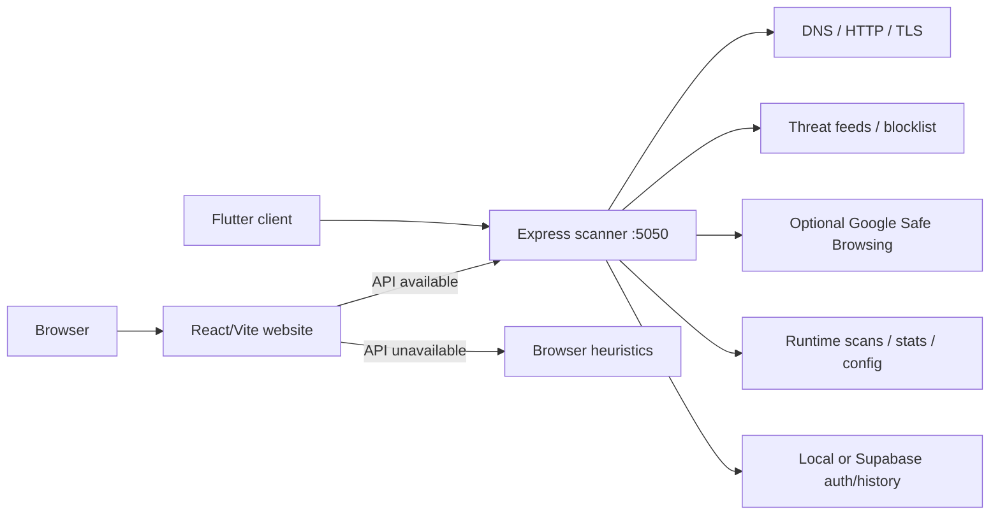

# URLY Warning

URLY Warning is an open-source URL safety scanner with a React/Vite website, a Node/Express analysis service, and a separate Flutter client. It evaluates links with structural heuristics and can add DNS, HTTP, TLS, threat-feed, and Google Safe Browsing checks when the local scanner service is running.

**Live website:** [jester-penlza.github.io/Urly-Warning](https://jester-penlza.github.io/Urly-Warning/)

> The GitHub Pages deployment is a static frontend. It performs browser-side heuristic analysis when no scanner API is available. Run the local Express service for the complete scan pipeline.

## What it includes

- Multi-URL scanning with safe, caution, and unsafe verdicts
- Detailed evidence rows, safety-score breakdowns, and recommendations
- Browser-only fallback for the public static deployment
- Optional DNS, redirect, TLS, external-link, and content inspection
- Local and downloaded threat feeds plus a runtime custom blocklist
- Optional Google Safe Browsing integration through the server
- Scan history, filtering, configuration, import/export, and display controls
- Persistent light/dark theme that remains independent of sensitivity changes
- Direct website access without a login or registration gate
- Optional local or Supabase-backed auth/history API for other clients
- A Flutter application with its own authenticated route flow

## Architecture



The full file map, request flows, endpoint tables, runtime modes, and task-oriented reading guide are in [GRAPHIFY.md](GRAPHIFY.md).

## Repository layout

```text
Urly-Warning/
├─ .github/workflows/        # GitHub Pages deployment
├─ README.md                 # project overview
├─ GRAPHIFY.md               # detailed technical map
├─ SECURITY.md               # security policy
└─ Websz/                    # application root
   ├─ src/                   # React routes and configuration UI
   ├─ public/                # page fragments, browser scanner, CSS, assets
   ├─ scanner/               # Express scanner service
   ├─ database/              # auth, history, Supabase integration
   ├─ feeds/                 # threat-list inputs
   ├─ tests/                 # integration and browser tests
   ├─ docs/                  # detailed technical documentation
   └─ urly_warning_flutter/  # Flutter client
```

## Quick start

Requirements: Node.js 18 or newer and npm.

```powershell
git clone https://github.com/Jester-Penlza/Urly-Warning.git
cd Urly-Warning\Websz
npm ci
```

Run the frontend and scanner together on Windows:

```powershell
npm run dev:all
```

Or use two terminals:

```powershell
# Terminal 1: scanner API at http://localhost:5050
npm run scan

# Terminal 2: Vite development website
npm run dev
```

Open the URL printed by Vite. The website starts at `#/home`; `/login`, `/register`, and unknown website routes redirect to home.

## Useful commands

| Command | Purpose |
|---|---|
| `npm run dev` | Start the Vite frontend |
| `npm run scan` | Start the Express scanner API |
| `npm run dev:all` | Start both on Windows |
| `npm run build` | Create a production frontend build |
| `npm run preview` | Preview the current production build |
| `npm run test:web` | Build and run browser end-to-end checks |
| `npm run test:deployment` | Verify the live static site's fallback scan and complete breakdown |
| `npm run security:check` | Check tracked files for secrets/private artifacts |
| `npm run feeds:update` | Refresh normalized public threat feeds |

## Verification

The browser end-to-end suite checks:

- Home, About, Services, and Contact routes
- Login/register and unknown-route redirects
- Theme persistence and sensitivity-slider isolation
- Configuration reset behavior
- A live scan with details, score breakdown, recommendations, and history
- Display-setting toggles and scanner restart
- Migration of older saved settings that accidentally hid result sections

With dependencies installed, run:

```powershell
cd Websz
npm run test:web
npm run security:check
```

The scanner also has focused runtime suites:

```powershell
# Run npm run scan in another terminal first
node tests/test-integration.js
node tests/test-config-system.js
```

## Configuration and private data

Copy variable names from `Websz/.env.example` only when optional integrations are needed. Never commit real `.env` files, API keys, passwords, database exports, or `config/scanner.config.json`.

Google Safe Browsing and Supabase service credentials are server-side secrets. Vite variables are delivered to the browser and must not contain private credentials. See [SECURITY.md](SECURITY.md) for the reporting and handling policy.

## Deployment

Pushes to `main` run the GitHub Pages workflow in `.github/workflows/deploy-pages.yml`. It performs the tracked-file security check, installs locked dependencies, builds with the `/Urly-Warning/` base path, and publishes `Websz/dist`.

GitHub Pages cannot run the Express backend. Hosting the full server-assisted scanner requires a separate Node-compatible service and securely configured environment variables.

## Documentation

- [Repository graph and technical guide](GRAPHIFY.md)
- [Security policy](SECURITY.md)
- [API documentation](Websz/docs/api/API-DOCUMENTATION.md)
- [Configuration guide](Websz/docs/configuration/CONFIGURATION-GUIDE.md)
- [Flutter functional specification](Websz/FLUTTER-WEB-ANDROID-FUNCTIONAL-SPEC.md)
